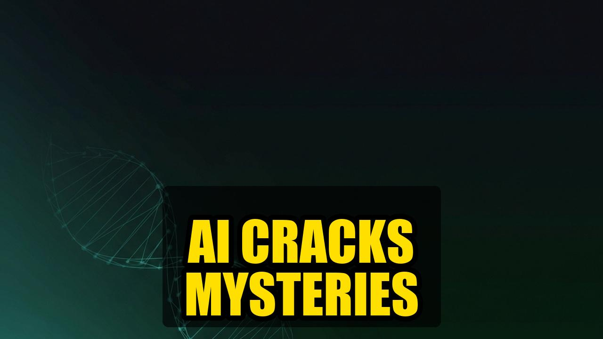
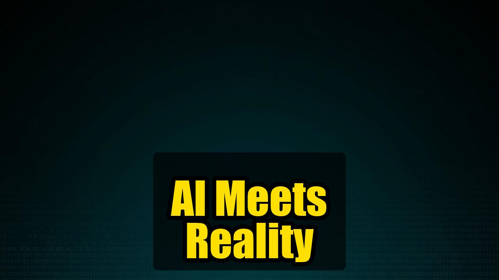

---

---

## Latest Guides

<table><tr>
<td align="center" width="33%">
<a href="https://bgill55.github.io/-weightandsee-guides/guides/ai-solved-18-rare-disease-cases-doctors-couldnt-crack-heres-how/">
 
<b>Ai Solved 18 Rare Disease Cases Doctors Couldnt Crack Heres How</b>
</a>
</td>
<td align="center" width="33%">
<a href="https://bgill55.github.io/-weightandsee-guides/guides/suitcase-robot-meets-llm-when-physical-sensors-control-ai-randomness/">
 
<b>Suitcase Robot Meets Llm When Physical Sensors Control Ai Randomness</b>
</a>
</td>
<td align="center" width="33%">
<a href="https://bgill55.github.io/-weightandsee-guides/guides/the-privacy-exodus-why-local-llms-are-drowning-out-the-cloud-giants/">
 
<b>The Privacy Exodus Why Local Llms Are Drowning Out The Cloud Giants</b>
</a>
</td>
</tr></table>

---

## Quick Navigation

| Category | Count |
|----------|-------|
| **Benchmarks & Comparisons** |  |
| **Model Deep Dives** |  |
| **Local AI & Self-Hosting** |  |
| **AI Security** |  |
| **Developer Tools & Agents** |  |
| **Image & Vision** |  |
| **No-Code & Automation** |  |

---

## Benchmarks & Comparisons

*Head-to-head model showdowns and real-world performance tests*

- **[Goose Vs Claude Code We Built The Same Project With Both The Results Were Shocki](https://bgill55.github.io/-weightandsee-guides/guides/goose-vs-claude-code-we-built-the-same-project-with-both-the-results-were-shocki/)** — 2026-06-17
- **[The Anthropic Vs David Sacks Fight What It Means For Open Weight Ai In 2026](https://bgill55.github.io/-weightandsee-guides/guides/the-anthropic-vs-david-sacks-fight-what-it-means-for-open-weight-ai-in-2026/)** — 2026-06-17
- **[Tool Review Sp Implementations Vs Classic Plugandplay Restorers](https://bgill55.github.io/-weightandsee-guides/guides/tool-review-sp-implementations-vs-classic-plugandplay-restorers/)** — 2026-06-16
- **[Permavid Deep Dive The Ai That Never Forgets Your Video Identity](https://bgill55.github.io/-weightandsee-guides/guides/permavid-deep-dive-the-ai-that-never-forgets-your-video-identity/)** — 2026-06-16
- **[Deep Dive into AdaHmpLEng — Efficient Small-Scale English Model](https://bgill55.github.io/-weightandsee-guides/guides/deep-dive-into-adahmpleng-50m-5ep-1e-4-64b-efficient-smallscale-english-model/)** — 2026-06-15
- **[Google Vs Meta Vs Openai The 2026 Ai Search Faceoff](https://bgill55.github.io/-weightandsee-guides/guides/google-vs-meta-vs-openai-the-2026-ai-search-faceoff/)** — 2026-06-15
- **[Local Vs Cloud Object Detection Showdown Latency Privacy And Cost Per Frame](https://bgill55.github.io/-weightandsee-guides/guides/local-vs-cloud-object-detection-showdown-latency-privacy-and-cost-per-frame/)** — 2026-06-14
- **[Supertonic 3 Beats Google Cloud Tts Ondevice Multilingual Speed Privacy Test](https://bgill55.github.io/-weightandsee-guides/guides/supertonic-3-beats-google-cloud-tts-ondevice-multilingual-speed-privacy-test/)** — 2026-06-13
- **[Kimik27Code Vs Copilot Vs Codewhisperer Who Wins The Coding Race](https://bgill55.github.io/-weightandsee-guides/guides/kimik27code-vs-copilot-vs-codewhisperer-who-wins-the-coding-race/)** — 2026-06-13
- **[Local Vs Cloud Ai Inference A Real Cost And Performance Comparison](https://bgill55.github.io/-weightandsee-guides/guides/local-vs-cloud-ai-inference-a-real-cost-and-performance-comparison/)** — 2026-06-13
- **[Flux Core Vs Rendermax 3D Generation Showdown](https://bgill55.github.io/-weightandsee-guides/guides/flux-core-vs-rendermax-3d-generation-showdown/)** — 2026-06-13
- **[Flux 2 The New Standard For Realtime Ai Video Generation](https://bgill55.github.io/-weightandsee-guides/guides/flux-2-the-new-standard-for-realtime-ai-video-generation/)** — 2026-06-12
- **[Gpt 55 Vs Llama 4 Safety Guardrails Which Handles Coldstart Better](https://bgill55.github.io/-weightandsee-guides/guides/gpt-55-vs-llama-4-safety-guardrails-which-handles-coldstart-better/)** — 2026-06-12
- **[Ollama Vs Lm Studio Vs Localai 2026 Local Llm Performance Showdown](https://bgill55.github.io/-weightandsee-guides/guides/ollama-vs-lm-studio-vs-localai-2026-local-llm-performance-showdown/)** — 2026-06-12
- **[Gpu Showdown Chatgpt V5 Vs Llama 4 Vs Deepseek V4 On A Single Rtx 4090](https://bgill55.github.io/-weightandsee-guides/guides/gpu-showdown-chatgpt-v5-vs-llama-4-vs-deepseek-v4-on-a-single-rtx-4090/)** — 2026-06-12
- **[Ollama Vs Lm Studio Battle For The Fastest Llama 4 Inference On A Rtx 4090](https://bgill55.github.io/-weightandsee-guides/guides/ollama-vs-lm-studio-battle-for-the-fastest-llama-4-inference-on-a-rtx-4090/)** — 2026-06-12
- **[The Offline Security Stack Running Llama 4 For Pentesting](https://bgill55.github.io/-weightandsee-guides/guides/the-offline-security-stack-running-llama-4-for-pentesting/)** — 2026-06-11
- **[Nova 100M New Vs Circuit Breaker Which 2026 Model Wins The Speed Race](https://bgill55.github.io/-weightandsee-guides/guides/nova-100m-new-vs-circuit-breaker-which-2026-model-wins-the-speed-race/)** — 2026-06-11
- **[WhisperSmall-Hi — The Tiny Transcriber That Beats Cloud APIs](https://bgill55.github.io/-weightandsee-guides/guides/whispersmallhi-the-tiny-transcriber-that-beats-cloud-apis/)** — 2026-06-11
- **[Running Ideogram 4 FP8 Locally — Quantization Benchmarks & Cost](https://bgill55.github.io/-weightandsee-guides/guides/running-ideogram-4-fp8-locally-fp8-quantization-benchmarks-and-cost-analysis/)** — 2026-06-11
- **[Gemma 4 vs GPT-5.5 vs DeepSeek V4 — Real-World 12B Benchmark Showdown](https://bgill55.github.io/-weightandsee-guides/guides/gemma-4-vs-gpt55-deepseekv4-realworld-12b-benchmark-showdown/)** — 2026-06-11
- **[Gemma 4 12-Bit vs Llama 4 — The Lightweight Coding AI Showdown](https://bgill55.github.io/-weightandsee-guides/guides/gemma412bit-vs-llama4-the-lightweight-coding-ai-showdown/)** — 2026-06-11
- **[HustleGemini vs Cursor 6 — The Agentic Coding Showdown](https://bgill55.github.io/-weightandsee-guides/guides/hustlegemini-vs-cursor-6-the-agentic-coding-showdown/)** — 2026-06-10
- **[Llama 4 Turbo Local — The 48GB VRAM Reality Check](https://bgill55.github.io/-weightandsee-guides/guides/llama-4-turbo-local-the-48gb-vram-reality-check/)** — 2026-06-10
- **[VisionaryAI 2026 Review — 8K Images on a Laptop GPU](https://bgill55.github.io/-weightandsee-guides/guides/visionaryai-2026-review-8k-images-on-a-laptop-gpu/)** — 2026-06-10
- **[GPT-4o vs Claude 3.5 vs Gemini 2.0 — Real-World Office Task Benchmark](https://bgill55.github.io/-weightandsee-guides/guides/gpt4o-vs-claude-35-vs-gemini-20-realworld-office-task-benchmark-june-2026/)** — 2026-06-10
- **[Qwen 3 72B vs Llama 4 Scout — macOS Container Benchmark on M3](https://bgill55.github.io/-weightandsee-guides/guides/qwen-3-72b-vs-llama-4-scout-realworld-macos-container-machine-benchmark-on-m3-ma/)** — 2026-06-10
- **[UniCAD 7B vs Cloud Giants — Can Local AI Engineer Real Parts?](https://bgill55.github.io/-weightandsee-guides/guides/unicad-7b-vs-cloud-giants-can-local-ai-engineer-real-parts/)** — 2026-06-09
- **[Qwen 3 72B vs Llama 4 Scout — Speed Test on a $500 GPU](https://bgill55.github.io/-weightandsee-guides/guides/qwen-3-72b-vs-llama-4-scout-realworld-speed-test-on-a-500-gpu/)** — 2026-06-09
- **[Ollama 0.7 — Offline 13B LLM on an 8GB Laptop](https://bgill55.github.io/-weightandsee-guides/guides/ollama-07-offline-13b-llm-on-an-8-gb-laptop-does-it-really-work/)** — 2026-06-09

---

## Model Deep Dives

*In-depth analysis of cutting-edge AI models and architectures*

- **[Ai Solved 18 Rare Disease Cases Doctors Couldnt Crack Heres How](https://bgill55.github.io/-weightandsee-guides/guides/ai-solved-18-rare-disease-cases-doctors-couldnt-crack-heres-how/)** — 2026-06-18
- **[Suitcase Robot Meets Llm When Physical Sensors Control Ai Randomness](https://bgill55.github.io/-weightandsee-guides/guides/suitcase-robot-meets-llm-when-physical-sensors-control-ai-randomness/)** — 2026-06-18
- **[What Noam Shazeer Built At Google And Why Openai Needs It Now](https://bgill55.github.io/-weightandsee-guides/guides/what-noam-shazeer-built-at-google-and-why-openai-needs-it-now/)** — 2026-06-18
- **[Concept 3 Building Your Private Ai Assistant With Local Models](https://bgill55.github.io/-weightandsee-guides/guides/concept-3-building-your-private-ai-assistant-with-local-models/)** — 2026-06-17
- **[The Microsoft AI Forge Hack — How They Stole Your API Keys](https://bgill55.github.io/-weightandsee-guides/guides/the-microsoft-ai-forge-hack-how-they-stole-your-api-keys/)** — 2026-06-15
- **[The OmniVision 7 Paper — Why AI Finally Understands Motion](https://bgill55.github.io/-weightandsee-guides/guides/the-omnivision-7-paper-why-ai-finally-understands-motion/)** — 2026-06-15
- **[MetaVision 2.0 API Deep Dive — Is It Worth the Hype?](https://bgill55.github.io/-weightandsee-guides/guides/metavision-20-api-deep-dive-is-the-new-multimodal-model-worth-the-hype/)** — 2026-06-15
- **[Advantages Of On Device Ai A Deep Dive Into Jeidobanironsmith](https://bgill55.github.io/-weightandsee-guides/guides/advantages-of-on-device-ai-a-deep-dive-into-jeidobanironsmith/)** — 2026-06-15
- **[Agent Reach Deep Dive Free Open Source Alternative To Paid Apis](https://bgill55.github.io/-weightandsee-guides/guides/agent-reach-deep-dive-free-open-source-alternative-to-paid-apis/)** — 2026-06-15
- **[Why Minimax M3 Breaks The Alphazero Compute Mold](https://bgill55.github.io/-weightandsee-guides/guides/why-minimax-m3-breaks-the-alphazero-compute-mold/)** — 2026-06-15
- **[The Future Of Reactive Audio How Flux 2 Changes Game Design](https://bgill55.github.io/-weightandsee-guides/guides/the-future-of-reactive-audio-how-flux-2-changes-game-design/)** — 2026-06-13
- **[Supertonic Review Is Local Tts Finally Viable](https://bgill55.github.io/-weightandsee-guides/guides/supertonic-review-is-local-tts-finally-viable/)** — 2026-06-13
- **[Automating Your Business With Fable And Mythos](https://bgill55.github.io/-weightandsee-guides/guides/automating-your-business-with-fable-and-mythos/)** — 2026-06-13
- **[Ollama V090 Run Any Llm Locally In 2026 Heres What Changed](https://bgill55.github.io/-weightandsee-guides/guides/ollama-v090-run-any-llm-locally-in-2026-heres-what-changed/)** — 2026-06-13
- **[Nvidia H100 Tensor Core Deep Dive What The New Hopper Gpu Means For Ai Workloads](https://bgill55.github.io/-weightandsee-guides/guides/nvidia-h100-tensor-core-deep-dive-what-the-new-hopper-gpu-means-for-ai-workloads/)** — 2026-06-13
- **[Chatgpt V5 The New Ai Weapon For Autonomous Penetration Testing](https://bgill55.github.io/-weightandsee-guides/guides/chatgpt-v5-the-new-ai-weapon-for-autonomous-penetration-testing/)** — 2026-06-12
- **[How Flux 2S Texttovideo Engine Is Changing Creative Workflows](https://bgill55.github.io/-weightandsee-guides/guides/how-flux-2s-texttovideo-engine-is-changing-creative-workflows/)** — 2026-06-11
- **[Pentestai Review Aipowered Penetration Testing With Chatgpt V55](https://bgill55.github.io/-weightandsee-guides/guides/pentestai-review-aipowered-penetration-testing-with-chatgpt-v55/)** — 2026-06-11
- **[Unlocking AI Voice Synthesis — A Deep Dive into sundaycoil/text-to-speech](https://bgill55.github.io/-weightandsee-guides/guides/unlocking-ai-voice-synthesis-a-deep-dive-into-sundaycoiltext-to-speech-converter/)** — 2026-06-11
- **[The POISE Attack — I Poisoned an AI Agent in Real Time](https://bgill55.github.io/-weightandsee-guides/guides/the-poise-attack-i-poisoned-an-ai-agent-in-real-time/)** — 2026-06-11
- **[Unchaining AI — Is Qwen 3.6 Aggressive the Ultimate Local Powerhouse?](https://bgill55.github.io/-weightandsee-guides/guides/unchaining-ai-is-qwen-36-aggressive-the-ultimate-local-powerhouse/)** — 2026-06-11
- **[Inside the Microsoft AI Tool Breach — Timeline, Exploits & Patches](https://bgill55.github.io/-weightandsee-guides/guides/inside-the-microsoft-ai-tool-breach-timeline-exploits-and-patch-rollout/)** — 2026-06-09

---

## Local AI & Self-Hosting

*Run powerful AI models on your own hardware — no cloud required*

- **[The Privacy Exodus Why Local Llms Are Drowning Out The Cloud Giants](https://bgill55.github.io/-weightandsee-guides/guides/the-privacy-exodus-why-local-llms-are-drowning-out-the-cloud-giants/)** — 2026-06-18
- **[Data Ownership Battle Why Running Ai Cad Locally Is The Engineers New Superpower](https://bgill55.github.io/-weightandsee-guides/guides/data-ownership-battle-why-running-ai-cad-locally-is-the-engineers-new-superpower/)** — 2026-06-18
- **[Running LLMs Offline — A Step-by-Step Guide](https://bgill55.github.io/-weightandsee-guides/guides/running-llms-offline-a-stepbystep-guide/)** — 2026-06-15
- **[How Local Rag Works](https://bgill55.github.io/-weightandsee-guides/guides/how-local-rag-works/)** — 2026-06-15
- **[Prometheus Ai Engineer Jeff Bezoss Awsready Agent Takes On Ollama 09](https://bgill55.github.io/-weightandsee-guides/guides/prometheus-ai-engineer-jeff-bezoss-awsready-agent-takes-on-ollama-09/)** — 2026-06-15
- **[Run GPT-5.5 on a Raspberry Pi Zero — The Ultimate Low-Cost AI Hack](https://bgill55.github.io/-weightandsee-guides/guides/run-gpt55-on-a-raspberry-pi-zero-the-ultimate-lowcost-local-ai-hack/)** — 2026-06-15
- **[Toolsense Review Is This The Ultimate Debugger For Llm Agents](https://bgill55.github.io/-weightandsee-guides/guides/toolsense-review-is-this-the-ultimate-debugger-for-llm-agents/)** — 2026-06-13
- **[Consumer Gpus In 2026 Can Your Graphics Card Actually Run A 70B Model](https://bgill55.github.io/-weightandsee-guides/guides/consumer-gpus-in-2026-can-your-graphics-card-actually-run-a-70b-model/)** — 2026-06-13
- **[Nvidia Gh200 Grace Hopper Superchip What 2000 Gpulevel Ai Performance Means For](https://bgill55.github.io/-weightandsee-guides/guides/nvidia-gh200-grace-hopper-superchip-what-2000-gpulevel-ai-performance-means-for/)** — 2026-06-13
- **[Flux 2 Unleashed How The New Diffusion Engine Cuts Vram Cranks Up Speed](https://bgill55.github.io/-weightandsee-guides/guides/flux-2-unleashed-how-the-new-diffusion-engine-cuts-vram-cranks-up-speed/)** — 2026-06-11
- **[DiffusionGemma 4x Faster Text Generation — Speed Limits Broken](https://bgill55.github.io/-weightandsee-guides/guides/diffusiongemma-4x-faster-text-generation-how-the-new-model-breaks-speed-limits/)** — 2026-06-10
- **[Run Claude 3.5 Offline for Free — Full Setup on a $500 PC](https://bgill55.github.io/-weightandsee-guides/guides/run-claude-35-offline-for-free-opencode-full-setup-on-a-500-pc/)** — 2026-06-10

---

## AI Security

*Threats, vulnerabilities, and defenses in the AI era*

- **[Why Your Ai Agent Is Using The Wrong Model And How To Fix It](https://bgill55.github.io/-weightandsee-guides/guides/why-your-ai-agent-is-using-the-wrong-model-and-how-to-fix-it/)** — 2026-06-13
- **[Is Outlines 3.0 the Ultimate AI Firewall?](https://bgill55.github.io/-weightandsee-guides/guides/is-outlines-30-the-ultimate-ai-firewall/)** — 2026-06-11

---

## Developer Tools & Agents

*AI-powered coding assistants, agents, and developer workflows*

- **[What Happens When Ai Learns To Write Rocket Code Inside Domain Specific Llm Trai](https://bgill55.github.io/-weightandsee-guides/guides/what-happens-when-ai-learns-to-write-rocket-code-inside-domain-specific-llm-trai/)** — 2026-06-17
- **[What Happens When Ai Learns To Code Like A Rocket Scientist](https://bgill55.github.io/-weightandsee-guides/guides/what-happens-when-ai-learns-to-code-like-a-rocket-scientist/)** — 2026-06-17
- **[Freellmapi Test](https://bgill55.github.io/-weightandsee-guides/guides/freellmapi-test/)** — 2026-06-17
- **[Nocode Playbook Build A World Cup 2026 Predictor With Llms Typescript Realtime S](https://bgill55.github.io/-weightandsee-guides/guides/nocode-playbook-build-a-world-cup-2026-predictor-with-llms-typescript-realtime-s/)** — 2026-06-15
- **[Creating Mac Apps With Ai A Step By Step Guide](https://bgill55.github.io/-weightandsee-guides/guides/creating-mac-apps-with-ai-a-step-by-step-guide/)** — 2026-06-15
- **[Agent Reach Unpacked Free Allinone Internet Access For Ai Agents](https://bgill55.github.io/-weightandsee-guides/guides/agent-reach-unpacked-free-allinone-internet-access-for-ai-agents/)** — 2026-06-13
- **[Build a Gemini-Optimized App on Apple Silicon](https://bgill55.github.io/-weightandsee-guides/guides/build-a-gemini-optimized-app-on-apple-silicon-hands-on-tutorial/)** — 2026-06-09

---

## Image & Vision

*Image generation, computer vision, and visual AI*

- **[Text-to-CAD Just Got Real — The CADDY Model Breakdown](https://bgill55.github.io/-weightandsee-guides/guides/text-to-cad-just-got-real-the-caddy-model-breakdown/)** — 2026-06-15
- **[AutoVision vs Stable Diffusion 3.1 — Edge Image Generation Showdown](https://bgill55.github.io/-weightandsee-guides/guides/autovision-vs-stable-diffusion-31-edge-image-generation-showdown/)** — 2026-06-15
- **[DiffusionGemma 26B A4Bit — Fast Local Image Generator for Creators](https://bgill55.github.io/-weightandsee-guides/guides/diffusiongemma-26b-a4bit-the-new-fast-local-image-generator-for-creators/)** — 2026-06-11
- **[Llama 4 CAD — Generate Engineering-Grade Parts Offline](https://bgill55.github.io/-weightandsee-guides/guides/llama-4-cad-generate-engineering-grade-parts-offline/)** — 2026-06-09
- **[CAD-GPT 2.0 — Generating Production-Ready STEP Files in Seconds](https://bgill55.github.io/-weightandsee-guides/guides/cad-gpt-20-generating-production-ready-step-files-in-seconds/)** — 2026-06-09

---

## No-Code & Automation

*Build AI workflows without writing code*

- **[No-Code AI Orchestrators Face-Off — Flowise vs n8n vs AutoGPT Studio](https://bgill55.github.io/-weightandsee-guides/guides/nocode-ai-orchestrators-faceoff-flowise-20-vs-n8n-ai-30-vs-autogptstudio/)** — 2026-06-10

---

### 📺 Watch the Videos

Each guide corresponds to a video on the [Weight and See](https://youtube.com/@WeightnSee) YouTube channel.
Watch the video for visual walkthroughs, then use the guide for code snippets and step-by-step instructions.

