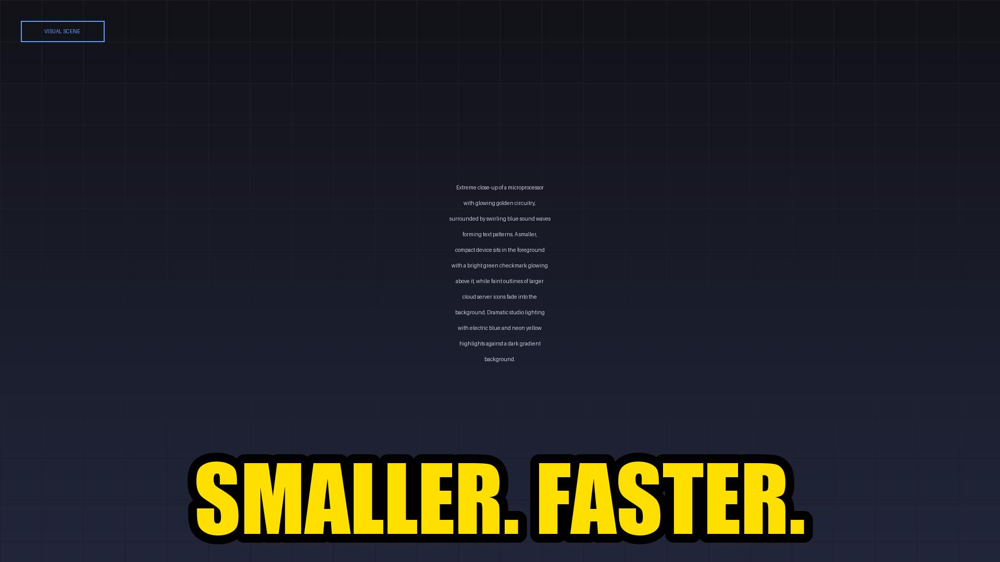
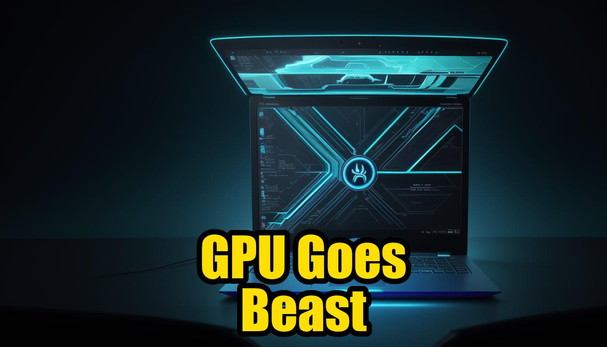

# 🎬 Weight and See — Guides Wiki

**Your signal through the noise of AI**

Comprehensive written guides, step-by-step tutorials, and resource pages
for every video on the [Weight and See](https://youtube.com/@WeightnSee) YouTube channel.

---

---

## 🆕 Latest Guides

<table><tr>
<td align="center" width="33%">
<a href="https://bgill55.github.io/-weightandsee-guides/guides/whispersmallhi-the-tiny-transcriber-that-beats-cloud-apis/">
 
<b>WhisperSmall-Hi — The Tiny Transcriber That Beats Cloud APIs</b>
</a>
</td>
<td align="center" width="33%">
<a href="https://bgill55.github.io/-weightandsee-guides/guides/visionaryai-2026-review-8k-images-on-a-laptop-gpu/">
 
<b>VisionaryAI 2026 Review — 8K Images on a Laptop GPU</b>
</a>
</td>
<td align="center" width="33%">
<a href="https://bgill55.github.io/-weightandsee-guides/guides/unlocking-ai-voice-synthesis-a-deep-dive-into-sundaycoiltext-to-speech-converter/">
 
<b>Unlocking AI Voice Synthesis — A Deep Dive into sundaycoil/text-to-speech</b>
</a>
</td>
</tr></table>

---

## 🧭 Quick Navigation

| Category | Guides |
|----------|--------|
| 🏆 Benchmarks & Comparisons | 8 guides |
| 🧠 Model Deep Dives | 7 guides |
| 💻 Local AI & Self-Hosting | 8 guides |
| 🛡️ AI Security | 4 guides |
| 🔧 Developer Tools & Agents | 3 guides |
| 🎨 Image & Vision | 3 guides |
| ⚡ No-Code & Automation | 1 guides |

---

## 🏆 Benchmarks & Comparisons

*Head-to-head model showdowns and real-world performance tests*

- 📸 **[Gemma 4 vs GPT-5.5 vs DeepSeek V4 — Real-World 12B Benchmark Showdown](https://bgill55.github.io/-weightandsee-guides/guides/gemma-4-vs-gpt55-deepseekv4-realworld-12b-benchmark-showdown/)**
- 📸 **[Gemma 4 12-Bit vs Llama 4 — The Lightweight Coding AI Showdown](https://bgill55.github.io/-weightandsee-guides/guides/gemma412bit-vs-llama4-the-lightweight-coding-ai-showdown/)**
- 📝 **[Qwen 3 72B vs Llama 4 Scout — macOS Container Benchmark on M3](https://bgill55.github.io/-weightandsee-guides/guides/qwen-3-72b-vs-llama-4-scout-realworld-macos-container-machine-benchmark-on-m3-ma/)**
- 📝 **[Qwen 3 72B vs Llama 4 Scout — Speed Test on a $500 GPU](https://bgill55.github.io/-weightandsee-guides/guides/qwen-3-72b-vs-llama-4-scout-realworld-speed-test-on-a-500-gpu/)**
- 📝 **[GPT-4o vs Claude 3.5 vs Gemini 2.0 — Real-World Office Task Benchmark](https://bgill55.github.io/-weightandsee-guides/guides/gpt4o-vs-claude-35-vs-gemini-20-realworld-office-task-benchmark-june-2026/)**
- 📸 **[HustleGemini vs Cursor 6 — The Agentic Coding Showdown](https://bgill55.github.io/-weightandsee-guides/guides/hustlegemini-vs-cursor-6-the-agentic-coding-showdown/)**
- 📸 **[AutoVision vs Stable Diffusion 3.1 — Edge Image Generation Showdown](https://bgill55.github.io/-weightandsee-guides/guides/autovision-vs-stable-diffusion-31-edge-image-generation-showdown/)**
- 📝 **[UniCAD 7B vs Cloud Giants — Can Local AI Engineer Real Parts?](https://bgill55.github.io/-weightandsee-guides/guides/unicad-7b-vs-cloud-giants-can-local-ai-engineer-real-parts/)**

---

## 🧠 Model Deep Dives

*In-depth analysis of cutting-edge AI models and architectures*

- 📸 **[Deep Dive into AdaHmpLEng — Efficient Small-Scale English Model](https://bgill55.github.io/-weightandsee-guides/guides/deep-dive-into-adahmpleng-50m-5ep-1e-4-64b-efficient-smallscale-english-model/)**
- 📸 **[The OmniVision 7 Paper — Why AI Finally Understands Motion](https://bgill55.github.io/-weightandsee-guides/guides/the-omnivision-7-paper-why-ai-finally-understands-motion/)**
- 📸 **[DiffusionGemma 4x Faster Text Generation — Speed Limits Broken](https://bgill55.github.io/-weightandsee-guides/guides/diffusiongemma-4x-faster-text-generation-how-the-new-model-breaks-speed-limits/)**
- 📸 **[DiffusionGemma 26B A4Bit — Fast Local Image Generator for Creators](https://bgill55.github.io/-weightandsee-guides/guides/diffusiongemma-26b-a4bit-the-new-fast-local-image-generator-for-creators/)**
- 📸 **[MetaVision 2.0 API Deep Dive — Is It Worth the Hype?](https://bgill55.github.io/-weightandsee-guides/guides/metavision-20-api-deep-dive-is-the-new-multimodal-model-worth-the-hype/)**
- 📸 **[Unlocking AI Voice Synthesis — A Deep Dive into sundaycoil/text-to-speech](https://bgill55.github.io/-weightandsee-guides/guides/unlocking-ai-voice-synthesis-a-deep-dive-into-sundaycoiltext-to-speech-converter/)**
- 📸 **[WhisperSmall-Hi — The Tiny Transcriber That Beats Cloud APIs](https://bgill55.github.io/-weightandsee-guides/guides/whispersmallhi-the-tiny-transcriber-that-beats-cloud-apis/)**

---

## 💻 Local AI & Self-Hosting

*Run powerful AI models on your own hardware — no cloud required*

- 📸 **[Llama 4 Turbo Local — The 48GB VRAM Reality Check](https://bgill55.github.io/-weightandsee-guides/guides/llama-4-turbo-local-the-48gb-vram-reality-check/)**
- 📝 **[Ollama 0.7 — Offline 13B LLM on an 8GB Laptop](https://bgill55.github.io/-weightandsee-guides/guides/ollama-07-offline-13b-llm-on-an-8-gb-laptop-does-it-really-work/)**
- 📝 **[Run Claude 3.5 Offline for Free — Full Setup on a $500 PC](https://bgill55.github.io/-weightandsee-guides/guides/run-claude-35-offline-for-free-opencode-full-setup-on-a-500-pc/)**
- 📸 **[Run GPT-5.5 on a Raspberry Pi Zero — The Ultimate Low-Cost AI Hack](https://bgill55.github.io/-weightandsee-guides/guides/run-gpt55-on-a-raspberry-pi-zero-the-ultimate-lowcost-local-ai-hack/)**
- 📸 **[Running Ideogram 4 FP8 Locally — Quantization Benchmarks & Cost](https://bgill55.github.io/-weightandsee-guides/guides/running-ideogram-4-fp8-locally-fp8-quantization-benchmarks-and-cost-analysis/)**
- 📝 **[Running LLMs Offline — A Step-by-Step Guide](https://bgill55.github.io/-weightandsee-guides/guides/running-llms-offline-a-stepbystep-guide/)**
- 📸 **[Unchaining AI — Is Qwen 3.6 Aggressive the Ultimate Local Powerhouse?](https://bgill55.github.io/-weightandsee-guides/guides/unchaining-ai-is-qwen-36-aggressive-the-ultimate-local-powerhouse/)**
- 📸 **[VisionaryAI 2026 Review — 8K Images on a Laptop GPU](https://bgill55.github.io/-weightandsee-guides/guides/visionaryai-2026-review-8k-images-on-a-laptop-gpu/)**

---

## 🛡️ AI Security

*Threats, vulnerabilities, and defenses in the AI era*

- 📝 **[Inside the Microsoft AI Tool Breach — Timeline, Exploits & Patches](https://bgill55.github.io/-weightandsee-guides/guides/inside-the-microsoft-ai-tool-breach-timeline-exploits-and-patch-rollout/)**
- 📝 **[The Microsoft AI Forge Hack — How They Stole Your API Keys](https://bgill55.github.io/-weightandsee-guides/guides/the-microsoft-ai-forge-hack-how-they-stole-your-api-keys/)**
- 📸 **[The POISE Attack — I Poisoned an AI Agent in Real Time](https://bgill55.github.io/-weightandsee-guides/guides/the-poise-attack-i-poisoned-an-ai-agent-in-real-time/)**
- 📸 **[Is Outlines 3.0 the Ultimate AI Firewall?](https://bgill55.github.io/-weightandsee-guides/guides/is-outlines-30-the-ultimate-ai-firewall/)**

---

## 🔧 Developer Tools & Agents

*AI-powered coding assistants, agents, and developer workflows*

- 📸 **[Build a Gemini-Optimized App on Apple Silicon](https://bgill55.github.io/-weightandsee-guides/guides/build-a-gemini-optimized-app-on-apple-silicon-hands-on-tutorial/)**
- 📸 **[Build a No-Code Claude FABLE 5 Agent in 5 Minutes](https://bgill55.github.io/-weightandsee-guides/guides/build-a-nocode-claude-fable-5-agent-in-5-minutes-no-coding-required/)**
- 📸 **[Claude FABLE 5 Desktop — Real-World Speed on a Hyper-V VM](https://bgill55.github.io/-weightandsee-guides/guides/claude-fable-5-desktop-test-realworld-speed-on-a-hyperv-vm/)**

---

## 🎨 Image & Vision

*Image generation, computer vision, and visual AI*

- 📝 **[CAD-GPT 2.0 — Generating Production-Ready STEP Files in Seconds](https://bgill55.github.io/-weightandsee-guides/guides/cad-gpt-20-generating-production-ready-step-files-in-seconds/)**
- 📝 **[Llama 4 CAD — Generate Engineering-Grade Parts Offline](https://bgill55.github.io/-weightandsee-guides/guides/llama-4-cad-generate-engineering-grade-parts-offline/)**
- 📝 **[Text-to-CAD Just Got Real — The CADDY Model Breakdown](https://bgill55.github.io/-weightandsee-guides/guides/text-to-cad-just-got-real-the-caddy-model-breakdown/)**

---

## ⚡ No-Code & Automation

*Build AI workflows without writing code*

- 📸 **[No-Code AI Orchestrators Face-Off — Flowise vs n8n vs AutoGPT Studio](https://bgill55.github.io/-weightandsee-guides/guides/nocode-ai-orchestrators-faceoff-flowise-20-vs-n8n-ai-30-vs-autogptstudio/)**

---

### 📺 Watch the Videos

Each guide corresponds to a video on the [Weight and See](https://youtube.com/@WeightnSee) YouTube channel.
Watch the video for visual walkthroughs, then use the guide for code snippets and step-by-step instructions.

