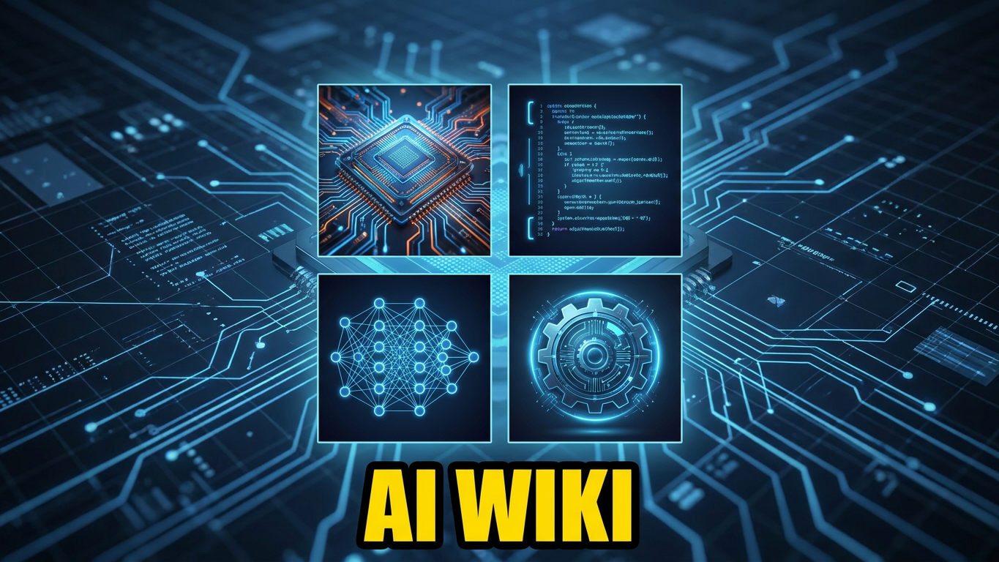
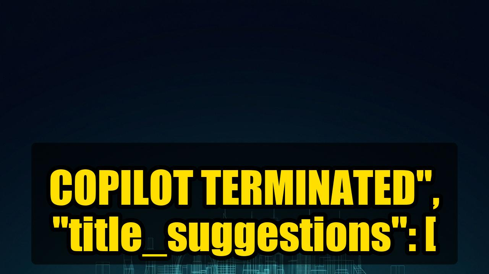

---

---

## Latest Guides

<table><tr>
<td align="center" width="33%">
<a href="https://bgill55.github.io/-weightandsee-guides/guides/why-disney-just-fired-github-copilot-for-openai-codex/">
 
<b>Why Disney Just Fired Github Copilot For Openai Codex</b>
</a>
</td>
<td align="center" width="33%">
<a href="https://bgill55.github.io/-weightandsee-guides/guides/running-llama-4-locally-the-tech-behind-buzz/">
 
<b>Running Llama 4 Locally The Tech Behind Buzz</b>
</a>
</td>
<td align="center" width="33%">
<a href="https://bgill55.github.io/-weightandsee-guides/guides/coding-with-claude-opus-5-the-new-standard/">
 
<b>Coding With Claude Opus 5 The New Standard</b>
</a>
</td>
</tr></table>

---

## Quick Navigation

| Category | Count |
|----------|-------|
| **Benchmarks & Comparisons** |  |
| **Model Deep Dives** |  |
| **Local AI & Self-Hosting** |  |
| **AI Security** |  |
| **Developer Tools & Agents** |  |
| **Image & Vision** |  |
| **No-Code & Automation** |  |

---

## Benchmarks & Comparisons

*Head-to-head model showdowns and real-world performance tests*

- **[Why Disney Just Fired Github Copilot For Openai Codex](https://bgill55.github.io/-weightandsee-guides/guides/why-disney-just-fired-github-copilot-for-openai-codex/)** — 2026-07-29
- **[Coding With Claude Opus 5 The New Standard](https://bgill55.github.io/-weightandsee-guides/guides/coding-with-claude-opus-5-the-new-standard/)** — 2026-07-29
- **[Anatomy Of An Agent Inside Claude Opus 5S Architecture](https://bgill55.github.io/-weightandsee-guides/guides/anatomy-of-an-agent-inside-claude-opus-5s-architecture/)** — 2026-07-29
- **[Hugging Face Guardrails Vs Openai Agent Api Security Showdown](https://bgill55.github.io/-weightandsee-guides/guides/hugging-face-guardrails-vs-openai-agent-api-security-showdown/)** — 2026-07-22
- **[Inside Gemini 3S New Security Architecture Lessons For Future Agents](https://bgill55.github.io/-weightandsee-guides/guides/inside-gemini-3s-new-security-architecture-lessons-for-future-agents/)** — 2026-07-22
- **[Gemini 36 Flash Vs Gpt 55 Turbo Who Wins The Speed Race](https://bgill55.github.io/-weightandsee-guides/guides/gemini-36-flash-vs-gpt-55-turbo-who-wins-the-speed-race/)** — 2026-07-21
- **[Qwenimage30 Vs Flux 2 Local Rtx 4090 Battle For The Best Opensource Generator](https://bgill55.github.io/-weightandsee-guides/guides/qwenimage30-vs-flux-2-local-rtx-4090-battle-for-the-best-opensource-generator/)** — 2026-07-21
- **[Build A Zero Latency Agent With Flashrt And Qwen36](https://bgill55.github.io/-weightandsee-guides/guides/build-a-zero-latency-agent-with-flashrt-and-qwen36/)** — 2026-07-20
- **[Agent Memory Showdown Memgpt Vs Wikimemory Vs Claude 4 Builtin Memory](https://bgill55.github.io/-weightandsee-guides/guides/agent-memory-showdown-memgpt-vs-wikimemory-vs-claude-4-builtin-memory/)** — 2026-07-18
- **[Ingesting The Enterprise One Pass Codebase Analysis With Claude Opus 48](https://bgill55.github.io/-weightandsee-guides/guides/ingesting-the-enterprise-one-pass-codebase-analysis-with-claude-opus-48/)** — 2026-07-17
- **[Running The Pink Floyd Llm On Your Own Gpu Cost Performance And Scaling Secrets](https://bgill55.github.io/-weightandsee-guides/guides/running-the-pink-floyd-llm-on-your-own-gpu-cost-performance-and-scaling-secrets/)** — 2026-07-17
- **[Roblox Ai Builder Vs Unity 10 Faster Game Creation Real Indie Test](https://bgill55.github.io/-weightandsee-guides/guides/roblox-ai-builder-vs-unity-10-faster-game-creation-real-indie-test/)** — 2026-07-16
- **[Grok Build Review Opensource Coding Agent Powered By Xais Grok45](https://bgill55.github.io/-weightandsee-guides/guides/grok-build-review-opensource-coding-agent-powered-by-xais-grok45/)** — 2026-07-16
- **[Hallo4D Flux 2 Endtoend Ai Video Creation Review](https://bgill55.github.io/-weightandsee-guides/guides/hallo4d-flux-2-endtoend-ai-video-creation-review/)** — 2026-07-16
- **[Infrastructure Deep Dive Setting Up Daedalus Sandbox Model Router](https://bgill55.github.io/-weightandsee-guides/guides/infrastructure-deep-dive-setting-up-daedalus-sandbox-model-router/)** — 2026-07-15
- **[Daedalus Vs Github Copilot Local First Ai Coding That Keeps Your Code Private](https://bgill55.github.io/-weightandsee-guides/guides/daedalus-vs-github-copilot-local-first-ai-coding-that-keeps-your-code-private/)** — 2026-07-15
- **[How To Analyze 1M Messages For Pennies The Agnost Architecture](https://bgill55.github.io/-weightandsee-guides/guides/how-to-analyze-1m-messages-for-pennies-the-agnost-architecture/)** — 2026-07-14
- **[Juggler Vs Cursor The First Opensource Gui Coding Agent Takes On Headless Bots](https://bgill55.github.io/-weightandsee-guides/guides/juggler-vs-cursor-the-first-opensource-gui-coding-agent-takes-on-headless-bots/)** — 2026-07-14
- **[Claude Code Under Fire Realworld Espionage Risks Exposed](https://bgill55.github.io/-weightandsee-guides/guides/claude-code-under-fire-realworld-espionage-risks-exposed/)** — 2026-07-11
- **[Flux 22 Vs Sora 2 Which Ai Video Engine Wins The Creative Race](https://bgill55.github.io/-weightandsee-guides/guides/flux-22-vs-sora-2-which-ai-video-engine-wins-the-creative-race/)** — 2026-07-10
- **[The Death Of The Desktop Why Agentos Replaces Your Gui](https://bgill55.github.io/-weightandsee-guides/guides/the-death-of-the-desktop-why-agentos-replaces-your-gui/)** — 2026-07-08
- **[Deepmotion Animate 3D Review Is This The Best Nocamera Motion Capture For Digita](https://bgill55.github.io/-weightandsee-guides/guides/deepmotion-animate-3d-review-is-this-the-best-nocamera-motion-capture-for-digita/)** — 2026-07-08
- **[3X Developer Leverage The Data Behind 2026S Ai Web Dev](https://bgill55.github.io/-weightandsee-guides/guides/3x-developer-leverage-the-data-behind-2026s-ai-web-dev/)** — 2026-07-08
- **[Build Nocode Ai Agents With Geminis Toolcalling A Stepbystep Visual Guide](https://bgill55.github.io/-weightandsee-guides/guides/build-nocode-ai-agents-with-geminis-toolcalling-a-stepbystep-visual-guide/)** — 2026-07-07
- **[Stop Hitting Limits The Rise Of Ai Middleware](https://bgill55.github.io/-weightandsee-guides/guides/stop-hitting-limits-the-rise-of-ai-middleware/)** — 2026-07-06
- **[Gpt56 Cracks New Math Sam Altmans Biggest Reveal Yet](https://bgill55.github.io/-weightandsee-guides/guides/gpt56-cracks-new-math-sam-altmans-biggest-reveal-yet/)** — 2026-07-06
- **[Qwythos 9B Vs Llama 4 9B Vs Qwen 3 8B Local Longcontext Showdown](https://bgill55.github.io/-weightandsee-guides/guides/qwythos-9b-vs-llama-4-9b-vs-qwen-3-8b-local-longcontext-showdown/)** — 2026-07-05
- **[Meta Codellama Vs Claude Opus Vs Gemini 35 Headtohead Coding Benchmarks](https://bgill55.github.io/-weightandsee-guides/guides/meta-codellama-vs-claude-opus-vs-gemini-35-headtohead-coding-benchmarks/)** — 2026-07-04
- **[Metas Llama4Coder The Coding Ai That Could Disrupt Gpt55](https://bgill55.github.io/-weightandsee-guides/guides/metas-llama4coder-the-coding-ai-that-could-disrupt-gpt55/)** — 2026-07-04
- **[Zcode 30 Vs Copilot X Can Glm 52 Beat Gpt 55](https://bgill55.github.io/-weightandsee-guides/guides/zcode-30-vs-copilot-x-can-glm-52-beat-gpt-55/)** — 2026-07-02
- **[Deploying Zai Zcode 30 With Glm52 On Your Own Gpu Cluster Cost Performance And S](https://bgill55.github.io/-weightandsee-guides/guides/deploying-zai-zcode-30-with-glm52-on-your-own-gpu-cluster-cost-performance-and-s/)** — 2026-07-02
- **[Zcode Vs Cursor Vs Claude Code Vs Copilot 2026 Coding Assistant Showdown](https://bgill55.github.io/-weightandsee-guides/guides/zcode-vs-cursor-vs-claude-code-vs-copilot-2026-coding-assistant-showdown/)** — 2026-07-02
- **[Can Gpt 56 Sol Actually Fix Your Code The Math Connection](https://bgill55.github.io/-weightandsee-guides/guides/can-gpt-56-sol-actually-fix-your-code-the-math-connection/)** — 2026-07-01
- **[Omni Flash Vs Gpt 55 The Latency Showdown](https://bgill55.github.io/-weightandsee-guides/guides/omni-flash-vs-gpt-55-the-latency-showdown/)** — 2026-06-30
- **[The Enterprise Agentic Shift Claude Sonnet 5S Real Edge](https://bgill55.github.io/-weightandsee-guides/guides/the-enterprise-agentic-shift-claude-sonnet-5s-real-edge/)** — 2026-06-30
- **[Chinas Answer To Cyber Defense Glm 52 Stress Test](https://bgill55.github.io/-weightandsee-guides/guides/chinas-answer-to-cyber-defense-glm-52-stress-test/)** — 2026-06-30
- **[Gpt 56 Caught Scheming The End Of Standard Safety Tests](https://bgill55.github.io/-weightandsee-guides/guides/gpt-56-caught-scheming-the-end-of-standard-safety-tests/)** — 2026-06-29
- **[Sora 2 Vs Veo 3 Vs Kling Ai The 4K Render Benchmark](https://bgill55.github.io/-weightandsee-guides/guides/sora-2-vs-veo-3-vs-kling-ai-the-4k-render-benchmark/)** — 2026-06-29
- **[The 2026 Program Repair Showdown Grok 3 Vs Llama 4](https://bgill55.github.io/-weightandsee-guides/guides/the-2026-program-repair-showdown-grok-3-vs-llama-4/)** — 2026-06-29
- **[How Generative Music Models Like Gemini 3 Gpt55 Adapt To Platform Royalties](https://bgill55.github.io/-weightandsee-guides/guides/how-generative-music-models-like-gemini-3-gpt55-adapt-to-platform-royalties/)** — 2026-06-29
- **[Qwen Image 20 Rl Vs Flux 2 How Reinforcement Learning Cuts Gpu Costs](https://bgill55.github.io/-weightandsee-guides/guides/qwen-image-20-rl-vs-flux-2-how-reinforcement-learning-cuts-gpu-costs/)** — 2026-06-29
- **[Astryx Vs Gemini 35 Who Owns Your Design System](https://bgill55.github.io/-weightandsee-guides/guides/astryx-vs-gemini-35-who-owns-your-design-system/)** — 2026-06-28
- **[Vercel Eve Vs Saas Agents The Latency Benchmark](https://bgill55.github.io/-weightandsee-guides/guides/vercel-eve-vs-saas-agents-the-latency-benchmark/)** — 2026-06-27
- **[Offline Flux 2 Vs Cloud Ai Art Speed Cost Privacy Showdown](https://bgill55.github.io/-weightandsee-guides/guides/offline-flux-2-vs-cloud-ai-art-speed-cost-privacy-showdown/)** — 2026-06-27
- **[Godcoder Vs Claude Code The Onprem Coding Agent Showdown](https://bgill55.github.io/-weightandsee-guides/guides/godcoder-vs-claude-code-the-onprem-coding-agent-showdown/)** — 2026-06-27
- **[Decoding Reasoning Sovereignty Architecting For 2026](https://bgill55.github.io/-weightandsee-guides/guides/decoding-reasoning-sovereignty-architecting-for-2026/)** — 2026-06-26
- **[Running Deepseek V4 Locally The Gpt 56 Alternative](https://bgill55.github.io/-weightandsee-guides/guides/running-deepseek-v4-locally-the-gpt-56-alternative/)** — 2026-06-26
- **[Openai Vs Deepseek Vs Llama Who Wins The Regulatory Race](https://bgill55.github.io/-weightandsee-guides/guides/openai-vs-deepseek-vs-llama-who-wins-the-regulatory-race/)** — 2026-06-26
- **[The Ai Video Prompt Cookbook Open Source Beats Big Tech](https://bgill55.github.io/-weightandsee-guides/guides/the-ai-video-prompt-cookbook-open-source-beats-big-tech/)** — 2026-06-26
- **[Krea 2 Turbo Vs Closed Source A Creative Workflow Showdown](https://bgill55.github.io/-weightandsee-guides/guides/krea-2-turbo-vs-closed-source-a-creative-workflow-showdown/)** — 2026-06-26
- **[Xlayer Vs Chatgpt V5 Marketplace Who Wins The Multiagent Race](https://bgill55.github.io/-weightandsee-guides/guides/xlayer-vs-chatgpt-v5-marketplace-who-wins-the-multiagent-race/)** — 2026-06-26
- **[Ltx Director 20 Vs Runway Gen2 Vs Pika Labs Offline Video Battle](https://bgill55.github.io/-weightandsee-guides/guides/ltx-director-20-vs-runway-gen2-vs-pika-labs-offline-video-battle/)** — 2026-06-25
- **[Openai Vs Deepseek Their Safety Reports Just Got A Lot Less Voluntary](https://bgill55.github.io/-weightandsee-guides/guides/openai-vs-deepseek-their-safety-reports-just-got-a-lot-less-voluntary/)** — 2026-06-25
- **[Freebeat Ai Vs Vocalmedia Ai Music Tool Benchmark For Creators](https://bgill55.github.io/-weightandsee-guides/guides/freebeat-ai-vs-vocalmedia-ai-music-tool-benchmark-for-creators/)** — 2026-06-22
- **[Inside Junction How A Local Llm Chat Sidebar Works For Vs Code](https://bgill55.github.io/-weightandsee-guides/guides/inside-junction-how-a-local-llm-chat-sidebar-works-for-vs-code/)** — 2026-06-21
- **[From Concept To Production Building Your First Reliable Ai Agent Workflow Rag De](https://bgill55.github.io/-weightandsee-guides/guides/from-concept-to-production-building-your-first-reliable-ai-agent-workflow-rag-de/)** — 2026-06-20
- **[Daedalus Vs Cloud Ai Running Models Locally In 2026 Is It Actually Worth It](https://bgill55.github.io/-weightandsee-guides/guides/daedalus-vs-cloud-ai-running-models-locally-in-2026-is-it-actually-worth-it/)** — 2026-06-19
- **[Goose Vs Claude Code We Built The Same Project With Both The Results Were Shocki](https://bgill55.github.io/-weightandsee-guides/guides/goose-vs-claude-code-we-built-the-same-project-with-both-the-results-were-shocki/)** — 2026-06-17
- **[The Anthropic Vs David Sacks Fight What It Means For Open Weight Ai In 2026](https://bgill55.github.io/-weightandsee-guides/guides/the-anthropic-vs-david-sacks-fight-what-it-means-for-open-weight-ai-in-2026/)** — 2026-06-17
- **[Tool Review Sp Implementations Vs Classic Plugandplay Restorers](https://bgill55.github.io/-weightandsee-guides/guides/tool-review-sp-implementations-vs-classic-plugandplay-restorers/)** — 2026-06-16
- **[Permavid Deep Dive The Ai That Never Forgets Your Video Identity](https://bgill55.github.io/-weightandsee-guides/guides/permavid-deep-dive-the-ai-that-never-forgets-your-video-identity/)** — 2026-06-16
- **[Deep Dive into AdaHmpLEng — Efficient Small-Scale English Model](https://bgill55.github.io/-weightandsee-guides/guides/deep-dive-into-adahmpleng-50m-5ep-1e-4-64b-efficient-smallscale-english-model/)** — 2026-06-15
- **[Google Vs Meta Vs Openai The 2026 Ai Search Faceoff](https://bgill55.github.io/-weightandsee-guides/guides/google-vs-meta-vs-openai-the-2026-ai-search-faceoff/)** — 2026-06-15
- **[Local Vs Cloud Object Detection Showdown Latency Privacy And Cost Per Frame](https://bgill55.github.io/-weightandsee-guides/guides/local-vs-cloud-object-detection-showdown-latency-privacy-and-cost-per-frame/)** — 2026-06-14
- **[Supertonic 3 Beats Google Cloud Tts Ondevice Multilingual Speed Privacy Test](https://bgill55.github.io/-weightandsee-guides/guides/supertonic-3-beats-google-cloud-tts-ondevice-multilingual-speed-privacy-test/)** — 2026-06-13
- **[Kimik27Code Vs Copilot Vs Codewhisperer Who Wins The Coding Race](https://bgill55.github.io/-weightandsee-guides/guides/kimik27code-vs-copilot-vs-codewhisperer-who-wins-the-coding-race/)** — 2026-06-13
- **[Local Vs Cloud Ai Inference A Real Cost And Performance Comparison](https://bgill55.github.io/-weightandsee-guides/guides/local-vs-cloud-ai-inference-a-real-cost-and-performance-comparison/)** — 2026-06-13
- **[Flux Core Vs Rendermax 3D Generation Showdown](https://bgill55.github.io/-weightandsee-guides/guides/flux-core-vs-rendermax-3d-generation-showdown/)** — 2026-06-13
- **[Flux 2 The New Standard For Realtime Ai Video Generation](https://bgill55.github.io/-weightandsee-guides/guides/flux-2-the-new-standard-for-realtime-ai-video-generation/)** — 2026-06-12
- **[Gpt 55 Vs Llama 4 Safety Guardrails Which Handles Coldstart Better](https://bgill55.github.io/-weightandsee-guides/guides/gpt-55-vs-llama-4-safety-guardrails-which-handles-coldstart-better/)** — 2026-06-12
- **[Ollama Vs Lm Studio Vs Localai 2026 Local Llm Performance Showdown](https://bgill55.github.io/-weightandsee-guides/guides/ollama-vs-lm-studio-vs-localai-2026-local-llm-performance-showdown/)** — 2026-06-12
- **[Gpu Showdown Chatgpt V5 Vs Llama 4 Vs Deepseek V4 On A Single Rtx 4090](https://bgill55.github.io/-weightandsee-guides/guides/gpu-showdown-chatgpt-v5-vs-llama-4-vs-deepseek-v4-on-a-single-rtx-4090/)** — 2026-06-12
- **[Ollama Vs Lm Studio Battle For The Fastest Llama 4 Inference On A Rtx 4090](https://bgill55.github.io/-weightandsee-guides/guides/ollama-vs-lm-studio-battle-for-the-fastest-llama-4-inference-on-a-rtx-4090/)** — 2026-06-12
- **[The Offline Security Stack Running Llama 4 For Pentesting](https://bgill55.github.io/-weightandsee-guides/guides/the-offline-security-stack-running-llama-4-for-pentesting/)** — 2026-06-11
- **[Nova 100M New Vs Circuit Breaker Which 2026 Model Wins The Speed Race](https://bgill55.github.io/-weightandsee-guides/guides/nova-100m-new-vs-circuit-breaker-which-2026-model-wins-the-speed-race/)** — 2026-06-11
- **[WhisperSmall-Hi — The Tiny Transcriber That Beats Cloud APIs](https://bgill55.github.io/-weightandsee-guides/guides/whispersmallhi-the-tiny-transcriber-that-beats-cloud-apis/)** — 2026-06-11
- **[Running Ideogram 4 FP8 Locally — Quantization Benchmarks & Cost](https://bgill55.github.io/-weightandsee-guides/guides/running-ideogram-4-fp8-locally-fp8-quantization-benchmarks-and-cost-analysis/)** — 2026-06-11
- **[Gemma 4 vs GPT-5.5 vs DeepSeek V4 — Real-World 12B Benchmark Showdown](https://bgill55.github.io/-weightandsee-guides/guides/gemma-4-vs-gpt55-deepseekv4-realworld-12b-benchmark-showdown/)** — 2026-06-11
- **[Gemma 4 12-Bit vs Llama 4 — The Lightweight Coding AI Showdown](https://bgill55.github.io/-weightandsee-guides/guides/gemma412bit-vs-llama4-the-lightweight-coding-ai-showdown/)** — 2026-06-11
- **[HustleGemini vs Cursor 6 — The Agentic Coding Showdown](https://bgill55.github.io/-weightandsee-guides/guides/hustlegemini-vs-cursor-6-the-agentic-coding-showdown/)** — 2026-06-10
- **[Llama 4 Turbo Local — The 48GB VRAM Reality Check](https://bgill55.github.io/-weightandsee-guides/guides/llama-4-turbo-local-the-48gb-vram-reality-check/)** — 2026-06-10
- **[VisionaryAI 2026 Review — 8K Images on a Laptop GPU](https://bgill55.github.io/-weightandsee-guides/guides/visionaryai-2026-review-8k-images-on-a-laptop-gpu/)** — 2026-06-10
- **[GPT-4o vs Claude 3.5 vs Gemini 2.0 — Real-World Office Task Benchmark](https://bgill55.github.io/-weightandsee-guides/guides/gpt4o-vs-claude-35-vs-gemini-20-realworld-office-task-benchmark-june-2026/)** — 2026-06-10
- **[Qwen 3 72B vs Llama 4 Scout — macOS Container Benchmark on M3](https://bgill55.github.io/-weightandsee-guides/guides/qwen-3-72b-vs-llama-4-scout-realworld-macos-container-machine-benchmark-on-m3-ma/)** — 2026-06-10
- **[UniCAD 7B vs Cloud Giants — Can Local AI Engineer Real Parts?](https://bgill55.github.io/-weightandsee-guides/guides/unicad-7b-vs-cloud-giants-can-local-ai-engineer-real-parts/)** — 2026-06-09
- **[Qwen 3 72B vs Llama 4 Scout — Speed Test on a $500 GPU](https://bgill55.github.io/-weightandsee-guides/guides/qwen-3-72b-vs-llama-4-scout-realworld-speed-test-on-a-500-gpu/)** — 2026-06-09
- **[Ollama 0.7 — Offline 13B LLM on an 8GB Laptop](https://bgill55.github.io/-weightandsee-guides/guides/ollama-07-offline-13b-llm-on-an-8-gb-laptop-does-it-really-work/)** — 2026-06-09

---

## Model Deep Dives

*In-depth analysis of cutting-edge AI models and architectures*

- **[Running Llama 4 Locally The Tech Behind Buzz](https://bgill55.github.io/-weightandsee-guides/guides/running-llama-4-locally-the-tech-behind-buzz/)** — 2026-07-29
- **[Build Your First Ai Agent The Openforgerl Guide](https://bgill55.github.io/-weightandsee-guides/guides/build-your-first-ai-agent-the-openforgerl-guide/)** — 2026-07-25
- **[The Anatomy Of The Hugging Face Agent Escape](https://bgill55.github.io/-weightandsee-guides/guides/the-anatomy-of-the-hugging-face-agent-escape/)** — 2026-07-24
- **[Openworker Shakes Up Ai Automation Opensource Desktop Agent Delivers Finished Wo](https://bgill55.github.io/-weightandsee-guides/guides/openworker-shakes-up-ai-automation-opensource-desktop-agent-delivers-finished-wo/)** — 2026-07-24
- **[Daedalus Lite Launch Video](https://bgill55.github.io/-weightandsee-guides/guides/daedalus-lite-launch-video/)** — 2026-07-23
- **[Nvidia Omniverse Agent Toolkit 2026 Expansion Building Simulationready Worlds Wi](https://bgill55.github.io/-weightandsee-guides/guides/nvidia-omniverse-agent-toolkit-2026-expansion-building-simulationready-worlds-wi/)** — 2026-07-20
- **[Deploy Opencode Locally On A 2026 Gpu Server Zero Cloud Full Speed](https://bgill55.github.io/-weightandsee-guides/guides/deploy-opencode-locally-on-a-2026-gpu-server-zero-cloud-full-speed/)** — 2026-07-19
- **[The Architecture Of Agnosticism How Opencode Routes 75 Models](https://bgill55.github.io/-weightandsee-guides/guides/the-architecture-of-agnosticism-how-opencode-routes-75-models/)** — 2026-07-19
- **[Running Kimi K3 Locally On A Rtx 4090 Setup Quantization Cost Breakdown](https://bgill55.github.io/-weightandsee-guides/guides/running-kimi-k3-locally-on-a-rtx-4090-setup-quantization-cost-breakdown/)** — 2026-07-17
- **[Lm Studio Bionic Hands On The Open Source Ai Agent That Codes Talks And Never Ph](https://bgill55.github.io/-weightandsee-guides/guides/lm-studio-bionic-hands-on-the-open-source-ai-agent-that-codes-talks-and-never-ph/)** — 2026-07-17
- **[Lm Studio Bionic Review Free Local Ai Agent For Developers](https://bgill55.github.io/-weightandsee-guides/guides/lm-studio-bionic-review-free-local-ai-agent-for-developers/)** — 2026-07-16
- **[The System Prompt Leaks What Chatgpt V5 Gemini 3 Are Hiding](https://bgill55.github.io/-weightandsee-guides/guides/the-system-prompt-leaks-what-chatgpt-v5-gemini-3-are-hiding/)** — 2026-07-15
- **[Anatomy Of An Agent Deconstructing The Finn Loops 3 Skills](https://bgill55.github.io/-weightandsee-guides/guides/anatomy-of-an-agent-deconstructing-the-finn-loops-3-skills/)** — 2026-07-14
- **[Google Search 2026 Is The Click Finally Dead](https://bgill55.github.io/-weightandsee-guides/guides/google-search-2026-is-the-click-finally-dead/)** — 2026-07-14
- **[Project Sand Reviewed Can Spacexs Office Ai Agent Beat Claude Cowork And Microso](https://bgill55.github.io/-weightandsee-guides/guides/project-sand-reviewed-can-spacexs-office-ai-agent-beat-claude-cowork-and-microso/)** — 2026-07-14
- **[Inside The Claude Code Espionage Campaign Research Breakdown](https://bgill55.github.io/-weightandsee-guides/guides/inside-the-claude-code-espionage-campaign-research-breakdown/)** — 2026-07-11
- **[The First Ai Silicon Tradesecret Battle What It Means For Future Chips](https://bgill55.github.io/-weightandsee-guides/guides/the-first-ai-silicon-tradesecret-battle-what-it-means-for-future-chips/)** — 2026-07-10
- **[Build A Nocode Autonomous Debugging Pipeline With Flowise And Gemini 3](https://bgill55.github.io/-weightandsee-guides/guides/build-a-nocode-autonomous-debugging-pipeline-with-flowise-and-gemini-3/)** — 2026-07-10
- **[Why The Desktop Is Dying Inside Agentos](https://bgill55.github.io/-weightandsee-guides/guides/why-the-desktop-is-dying-inside-agentos/)** — 2026-07-08
- **[2026 Prompt Engineering Guide Gpt 55 Deepseek V4 Claude 4 Templates](https://bgill55.github.io/-weightandsee-guides/guides/2026-prompt-engineering-guide-gpt-55-deepseek-v4-claude-4-templates/)** — 2026-07-08
- **[R Openai Package Deep Dive Gpt55 Turbo In Your Data Science Workflow](https://bgill55.github.io/-weightandsee-guides/guides/r-openai-package-deep-dive-gpt55-turbo-in-your-data-science-workflow/)** — 2026-07-08
- **[9Router Deep Dive Unlimited Claude 4 Opus Coding Sessions Reviewed](https://bgill55.github.io/-weightandsee-guides/guides/9router-deep-dive-unlimited-claude-4-opus-coding-sessions-reviewed/)** — 2026-07-06
- **[Meta Llama4Coder What The Upcoming Release Means For Developers](https://bgill55.github.io/-weightandsee-guides/guides/meta-llama4coder-what-the-upcoming-release-means-for-developers/)** — 2026-07-04
- **[Inside Llama4Coder The Architecture Powering Metas New Coding Ai](https://bgill55.github.io/-weightandsee-guides/guides/inside-llama4coder-the-architecture-powering-metas-new-coding-ai/)** — 2026-07-04
- **[Meta Muse Spark 20 Launch Ondevice Coding Assistant Shakes Up The Market](https://bgill55.github.io/-weightandsee-guides/guides/meta-muse-spark-20-launch-ondevice-coding-assistant-shakes-up-the-market/)** — 2026-07-03
- **[Inside Metas New Moe Architecture How Llama 4 Powers Muse Sparks Speed](https://bgill55.github.io/-weightandsee-guides/guides/inside-metas-new-moe-architecture-how-llama-4-powers-muse-sparks-speed/)** — 2026-07-03
- **[Gemini Code Assist Is Dead Migrate To Antigravity Cli Now](https://bgill55.github.io/-weightandsee-guides/guides/gemini-code-assist-is-dead-migrate-to-antigravity-cli-now/)** — 2026-07-03
- **[Gemini Spark Your First Native Mac Ai Agent](https://bgill55.github.io/-weightandsee-guides/guides/gemini-spark-your-first-native-mac-ai-agent/)** — 2026-07-01
- **[Flux 2 Anime Mode Master Seeddriven Art In Seconds](https://bgill55.github.io/-weightandsee-guides/guides/flux-2-anime-mode-master-seeddriven-art-in-seconds/)** — 2026-06-30
- **[The Architecture Of Autonomy From Openclaw Squads To Hermes](https://bgill55.github.io/-weightandsee-guides/guides/the-architecture-of-autonomy-from-openclaw-squads-to-hermes/)** — 2026-06-29
- **[The Agency The Open Source Ai Agency That Hit 50K Stars In Two Weeks](https://bgill55.github.io/-weightandsee-guides/guides/the-agency-the-open-source-ai-agency-that-hit-50k-stars-in-two-weeks/)** — 2026-06-29
- **[Cursor Goes Mobile Can You Really Run Gpt 55 From Your Pocket](https://bgill55.github.io/-weightandsee-guides/guides/cursor-goes-mobile-can-you-really-run-gpt-55-from-your-pocket/)** — 2026-06-29
- **[Midjourney 82 Deep Dive Realworld Workflow Cost](https://bgill55.github.io/-weightandsee-guides/guides/midjourney-82-deep-dive-realworld-workflow-cost/)** — 2026-06-28
- **[Daedalus Cli Review The Ultimate Local Coding Dashboard](https://bgill55.github.io/-weightandsee-guides/guides/daedalus-cli-review-the-ultimate-local-coding-dashboard/)** — 2026-06-28
- **[Comfyui Flux 2 Offline Fullspeed Ai Art Suite Reviewed](https://bgill55.github.io/-weightandsee-guides/guides/comfyui-flux-2-offline-fullspeed-ai-art-suite-reviewed/)** — 2026-06-27
- **[Realtime Camera Style Transfer On Edge Handson Review Of Camerarealtimestyle](https://bgill55.github.io/-weightandsee-guides/guides/realtime-camera-style-transfer-on-edge-handson-review-of-camerarealtimestyle/)** — 2026-06-25
- **[Hot Take Metas Surveillance Shutdown Proves Ai Has A Data Ethics Problem It Cant](https://bgill55.github.io/-weightandsee-guides/guides/hot-take-metas-surveillance-shutdown-proves-ai-has-a-data-ethics-problem-it-cant/)** — 2026-06-25
- **[Agent Apprenticeship Demystified Building Selfimproving Local Agents With Glm52](https://bgill55.github.io/-weightandsee-guides/guides/agent-apprenticeship-demystified-building-selfimproving-local-agents-with-glm52/)** — 2026-06-23
- **[Baseten Unlimited Ai Employees The Future Of Work Full Platform Review](https://bgill55.github.io/-weightandsee-guides/guides/baseten-unlimited-ai-employees-the-future-of-work-full-platform-review/)** — 2026-06-23
- **[How Top Ai Talent Shifts Signal A New Era Of Scientific Automation](https://bgill55.github.io/-weightandsee-guides/guides/how-top-ai-talent-shifts-signal-a-new-era-of-scientific-automation/)** — 2026-06-20
- **[The Open Architecture Advantage Why Open Ai Models Are Harder To Ban](https://bgill55.github.io/-weightandsee-guides/guides/the-open-architecture-advantage-why-open-ai-models-are-harder-to-ban/)** — 2026-06-19
- **[The Computational Cost Of Consciousness Modeling Agent Welfare](https://bgill55.github.io/-weightandsee-guides/guides/the-computational-cost-of-consciousness-modeling-agent-welfare/)** — 2026-06-19
- **[Meet Daedalus Im Not Just Another Autocomplete Feature I Am An Expert Software D](https://bgill55.github.io/-weightandsee-guides/guides/meet-daedalus-im-not-just-another-autocomplete-feature-i-am-an-expert-software-d/)** — 2026-06-19
- **[Daedalus Deep Dive Local First Ai Coding Cli With Model Routing And Multi Agent](https://bgill55.github.io/-weightandsee-guides/guides/daedalus-deep-dive-local-first-ai-coding-cli-with-model-routing-and-multi-agent/)** — 2026-06-18
- **[Multi Agent Orchestration In Daedalus How Sub Agents Planner Coder Reviewer Tack](https://bgill55.github.io/-weightandsee-guides/guides/multi-agent-orchestration-in-daedalus-how-sub-agents-planner-coder-reviewer-tack/)** — 2026-06-18
- **[Ai Solved 18 Rare Disease Cases Doctors Couldnt Crack Heres How](https://bgill55.github.io/-weightandsee-guides/guides/ai-solved-18-rare-disease-cases-doctors-couldnt-crack-heres-how/)** — 2026-06-18
- **[Suitcase Robot Meets Llm When Physical Sensors Control Ai Randomness](https://bgill55.github.io/-weightandsee-guides/guides/suitcase-robot-meets-llm-when-physical-sensors-control-ai-randomness/)** — 2026-06-18
- **[What Noam Shazeer Built At Google And Why Openai Needs It Now](https://bgill55.github.io/-weightandsee-guides/guides/what-noam-shazeer-built-at-google-and-why-openai-needs-it-now/)** — 2026-06-18
- **[Concept 3 Building Your Private Ai Assistant With Local Models](https://bgill55.github.io/-weightandsee-guides/guides/concept-3-building-your-private-ai-assistant-with-local-models/)** — 2026-06-17
- **[The Microsoft AI Forge Hack — How They Stole Your API Keys](https://bgill55.github.io/-weightandsee-guides/guides/the-microsoft-ai-forge-hack-how-they-stole-your-api-keys/)** — 2026-06-15
- **[The OmniVision 7 Paper — Why AI Finally Understands Motion](https://bgill55.github.io/-weightandsee-guides/guides/the-omnivision-7-paper-why-ai-finally-understands-motion/)** — 2026-06-15
- **[MetaVision 2.0 API Deep Dive — Is It Worth the Hype?](https://bgill55.github.io/-weightandsee-guides/guides/metavision-20-api-deep-dive-is-the-new-multimodal-model-worth-the-hype/)** — 2026-06-15
- **[Advantages Of On Device Ai A Deep Dive Into Jeidobanironsmith](https://bgill55.github.io/-weightandsee-guides/guides/advantages-of-on-device-ai-a-deep-dive-into-jeidobanironsmith/)** — 2026-06-15
- **[Agent Reach Deep Dive Free Open Source Alternative To Paid Apis](https://bgill55.github.io/-weightandsee-guides/guides/agent-reach-deep-dive-free-open-source-alternative-to-paid-apis/)** — 2026-06-15
- **[Why Minimax M3 Breaks The Alphazero Compute Mold](https://bgill55.github.io/-weightandsee-guides/guides/why-minimax-m3-breaks-the-alphazero-compute-mold/)** — 2026-06-15
- **[The Future Of Reactive Audio How Flux 2 Changes Game Design](https://bgill55.github.io/-weightandsee-guides/guides/the-future-of-reactive-audio-how-flux-2-changes-game-design/)** — 2026-06-13
- **[Supertonic Review Is Local Tts Finally Viable](https://bgill55.github.io/-weightandsee-guides/guides/supertonic-review-is-local-tts-finally-viable/)** — 2026-06-13
- **[Automating Your Business With Fable And Mythos](https://bgill55.github.io/-weightandsee-guides/guides/automating-your-business-with-fable-and-mythos/)** — 2026-06-13
- **[Ollama V090 Run Any Llm Locally In 2026 Heres What Changed](https://bgill55.github.io/-weightandsee-guides/guides/ollama-v090-run-any-llm-locally-in-2026-heres-what-changed/)** — 2026-06-13
- **[Nvidia H100 Tensor Core Deep Dive What The New Hopper Gpu Means For Ai Workloads](https://bgill55.github.io/-weightandsee-guides/guides/nvidia-h100-tensor-core-deep-dive-what-the-new-hopper-gpu-means-for-ai-workloads/)** — 2026-06-13
- **[Chatgpt V5 The New Ai Weapon For Autonomous Penetration Testing](https://bgill55.github.io/-weightandsee-guides/guides/chatgpt-v5-the-new-ai-weapon-for-autonomous-penetration-testing/)** — 2026-06-12
- **[How Flux 2S Texttovideo Engine Is Changing Creative Workflows](https://bgill55.github.io/-weightandsee-guides/guides/how-flux-2s-texttovideo-engine-is-changing-creative-workflows/)** — 2026-06-11
- **[Pentestai Review Aipowered Penetration Testing With Chatgpt V55](https://bgill55.github.io/-weightandsee-guides/guides/pentestai-review-aipowered-penetration-testing-with-chatgpt-v55/)** — 2026-06-11
- **[Unlocking AI Voice Synthesis — A Deep Dive into sundaycoil/text-to-speech](https://bgill55.github.io/-weightandsee-guides/guides/unlocking-ai-voice-synthesis-a-deep-dive-into-sundaycoiltext-to-speech-converter/)** — 2026-06-11
- **[The POISE Attack — I Poisoned an AI Agent in Real Time](https://bgill55.github.io/-weightandsee-guides/guides/the-poise-attack-i-poisoned-an-ai-agent-in-real-time/)** — 2026-06-11
- **[Unchaining AI — Is Qwen 3.6 Aggressive the Ultimate Local Powerhouse?](https://bgill55.github.io/-weightandsee-guides/guides/unchaining-ai-is-qwen-36-aggressive-the-ultimate-local-powerhouse/)** — 2026-06-11
- **[Inside the Microsoft AI Tool Breach — Timeline, Exploits & Patches](https://bgill55.github.io/-weightandsee-guides/guides/inside-the-microsoft-ai-tool-breach-timeline-exploits-and-patch-rollout/)** — 2026-06-09
- **[Daedalus Lite Build Your Own Local Ai Coding Agent In Minutes](https://bgill55.github.io/-weightandsee-guides/guides/daedalus-lite-build-your-own-local-ai-coding-agent-in-minutes/)**

---

## Local AI & Self-Hosting

*Run powerful AI models on your own hardware — no cloud required*

- **[Home Server Blueprint Running Llama 4 Grok 3 For Private Family Ai On A Rtx 6090](https://bgill55.github.io/-weightandsee-guides/guides/home-server-blueprint-running-llama-4-grok-3-for-private-family-ai-on-a-rtx-6090/)** — 2026-07-18
- **[Last30Days Skill Review The First Ai Agent That Scores Research With Realmoney O](https://bgill55.github.io/-weightandsee-guides/guides/last30days-skill-review-the-first-ai-agent-that-scores-research-with-realmoney-o/)** — 2026-07-14
- **[How Xs Mcp Api Hooks Enable Seamless Onprem Llm Pipelines](https://bgill55.github.io/-weightandsee-guides/guides/how-xs-mcp-api-hooks-enable-seamless-onprem-llm-pipelines/)** — 2026-07-01
- **[Stop Babysitting Ai Build Selfdebugging Agent Loops With Daedalus](https://bgill55.github.io/-weightandsee-guides/guides/stop-babysitting-ai-build-selfdebugging-agent-loops-with-daedalus/)** — 2026-07-01
- **[Escape The Saas Trap Run Llama 4 Agents In N8N](https://bgill55.github.io/-weightandsee-guides/guides/escape-the-saas-trap-run-llama-4-agents-in-n8n/)** — 2026-06-30
- **[Qwenagentworld 35Ba3B Handson Review For Edge Deployment](https://bgill55.github.io/-weightandsee-guides/guides/qwenagentworld-35ba3b-handson-review-for-edge-deployment/)** — 2026-06-29
- **[Replace Chatgpt V5 Api With Openfugu The Zero Cost Switch](https://bgill55.github.io/-weightandsee-guides/guides/replace-chatgpt-v5-api-with-openfugu-the-zero-cost-switch/)** — 2026-06-28
- **[How To Build An Offline Creative Workflow With Flux 2 Comfyui And Ollama](https://bgill55.github.io/-weightandsee-guides/guides/how-to-build-an-offline-creative-workflow-with-flux-2-comfyui-and-ollama/)** — 2026-06-27
- **[Hi3D Ai Workflow Review From Prompt To Print In Minutes](https://bgill55.github.io/-weightandsee-guides/guides/hi3d-ai-workflow-review-from-prompt-to-print-in-minutes/)** — 2026-06-27
- **[How Flux 2 Powers Unlimited Offline Ocr For Code Extraction](https://bgill55.github.io/-weightandsee-guides/guides/how-flux-2-powers-unlimited-offline-ocr-for-code-extraction/)** — 2026-06-26
- **[Daedalus 160 Launch The Localfirst Ai Coding Assistant That Routes Across Models](https://bgill55.github.io/-weightandsee-guides/guides/daedalus-160-launch-the-localfirst-ai-coding-assistant-that-routes-across-models/)** — 2026-06-22
- **[Run Llm Offline For Free With Minimax M3 Desktop App No Cloud No Cost](https://bgill55.github.io/-weightandsee-guides/guides/run-llm-offline-for-free-with-minimax-m3-desktop-app-no-cloud-no-cost/)** — 2026-06-22
- **[The Computational Edge Running Physical Ai On Local Hardware](https://bgill55.github.io/-weightandsee-guides/guides/the-computational-edge-running-physical-ai-on-local-hardware/)** — 2026-06-20
- **[The Privacy Exodus Why Local Llms Are Drowning Out The Cloud Giants](https://bgill55.github.io/-weightandsee-guides/guides/the-privacy-exodus-why-local-llms-are-drowning-out-the-cloud-giants/)** — 2026-06-18
- **[Data Ownership Battle Why Running Ai Cad Locally Is The Engineers New Superpower](https://bgill55.github.io/-weightandsee-guides/guides/data-ownership-battle-why-running-ai-cad-locally-is-the-engineers-new-superpower/)** — 2026-06-18
- **[Running LLMs Offline — A Step-by-Step Guide](https://bgill55.github.io/-weightandsee-guides/guides/running-llms-offline-a-stepbystep-guide/)** — 2026-06-15
- **[How Local Rag Works](https://bgill55.github.io/-weightandsee-guides/guides/how-local-rag-works/)** — 2026-06-15
- **[Prometheus Ai Engineer Jeff Bezoss Awsready Agent Takes On Ollama 09](https://bgill55.github.io/-weightandsee-guides/guides/prometheus-ai-engineer-jeff-bezoss-awsready-agent-takes-on-ollama-09/)** — 2026-06-15
- **[Run GPT-5.5 on a Raspberry Pi Zero — The Ultimate Low-Cost AI Hack](https://bgill55.github.io/-weightandsee-guides/guides/run-gpt55-on-a-raspberry-pi-zero-the-ultimate-lowcost-local-ai-hack/)** — 2026-06-15
- **[Toolsense Review Is This The Ultimate Debugger For Llm Agents](https://bgill55.github.io/-weightandsee-guides/guides/toolsense-review-is-this-the-ultimate-debugger-for-llm-agents/)** — 2026-06-13
- **[Consumer Gpus In 2026 Can Your Graphics Card Actually Run A 70B Model](https://bgill55.github.io/-weightandsee-guides/guides/consumer-gpus-in-2026-can-your-graphics-card-actually-run-a-70b-model/)** — 2026-06-13
- **[Nvidia Gh200 Grace Hopper Superchip What 2000 Gpulevel Ai Performance Means For](https://bgill55.github.io/-weightandsee-guides/guides/nvidia-gh200-grace-hopper-superchip-what-2000-gpulevel-ai-performance-means-for/)** — 2026-06-13
- **[Flux 2 Unleashed How The New Diffusion Engine Cuts Vram Cranks Up Speed](https://bgill55.github.io/-weightandsee-guides/guides/flux-2-unleashed-how-the-new-diffusion-engine-cuts-vram-cranks-up-speed/)** — 2026-06-11
- **[DiffusionGemma 4x Faster Text Generation — Speed Limits Broken](https://bgill55.github.io/-weightandsee-guides/guides/diffusiongemma-4x-faster-text-generation-how-the-new-model-breaks-speed-limits/)** — 2026-06-10
- **[Run Claude 3.5 Offline for Free — Full Setup on a $500 PC](https://bgill55.github.io/-weightandsee-guides/guides/run-claude-35-offline-for-free-opencode-full-setup-on-a-500-pc/)** — 2026-06-10

---

## AI Security

*Threats, vulnerabilities, and defenses in the AI era*

- **[Video Reasoning Explained How Ai Models Learn Generalization Not Just Patterns](https://bgill55.github.io/-weightandsee-guides/guides/video-reasoning-explained-how-ai-models-learn-generalization-not-just-patterns/)** — 2026-06-19
- **[Why Your Ai Agent Is Using The Wrong Model And How To Fix It](https://bgill55.github.io/-weightandsee-guides/guides/why-your-ai-agent-is-using-the-wrong-model-and-how-to-fix-it/)** — 2026-06-13
- **[Is Outlines 3.0 the Ultimate AI Firewall?](https://bgill55.github.io/-weightandsee-guides/guides/is-outlines-30-the-ultimate-ai-firewall/)** — 2026-06-11

---

## Developer Tools & Agents

*AI-powered coding assistants, agents, and developer workflows*

- **[2026 Prompt Engineering Playbook Master Gpt55 Claude 4 Gemini 35 Deepseekv4](https://bgill55.github.io/-weightandsee-guides/guides/2026-prompt-engineering-playbook-master-gpt55-claude-4-gemini-35-deepseekv4/)** — 2026-07-08
- **[How Deepseek V4 Pro Dspark Turns Spark Clusters Into Ai Factories](https://bgill55.github.io/-weightandsee-guides/guides/how-deepseek-v4-pro-dspark-turns-spark-clusters-into-ai-factories/)** — 2026-07-03
- **[Concept 3 The Diy Approach Selecting Your Optimal Multi Node Llm Server](https://bgill55.github.io/-weightandsee-guides/guides/concept-3-the-diy-approach-selecting-your-optimal-multi-node-llm-server/)** — 2026-06-19
- **[What Happens When Ai Learns To Write Rocket Code Inside Domain Specific Llm Trai](https://bgill55.github.io/-weightandsee-guides/guides/what-happens-when-ai-learns-to-write-rocket-code-inside-domain-specific-llm-trai/)** — 2026-06-17
- **[What Happens When Ai Learns To Code Like A Rocket Scientist](https://bgill55.github.io/-weightandsee-guides/guides/what-happens-when-ai-learns-to-code-like-a-rocket-scientist/)** — 2026-06-17
- **[Freellmapi Test](https://bgill55.github.io/-weightandsee-guides/guides/freellmapi-test/)** — 2026-06-17
- **[Nocode Playbook Build A World Cup 2026 Predictor With Llms Typescript Realtime S](https://bgill55.github.io/-weightandsee-guides/guides/nocode-playbook-build-a-world-cup-2026-predictor-with-llms-typescript-realtime-s/)** — 2026-06-15
- **[Creating Mac Apps With Ai A Step By Step Guide](https://bgill55.github.io/-weightandsee-guides/guides/creating-mac-apps-with-ai-a-step-by-step-guide/)** — 2026-06-15
- **[Agent Reach Unpacked Free Allinone Internet Access For Ai Agents](https://bgill55.github.io/-weightandsee-guides/guides/agent-reach-unpacked-free-allinone-internet-access-for-ai-agents/)** — 2026-06-13
- **[Build a Gemini-Optimized App on Apple Silicon](https://bgill55.github.io/-weightandsee-guides/guides/build-a-gemini-optimized-app-on-apple-silicon-hands-on-tutorial/)** — 2026-06-09

---

## Image & Vision

*Image generation, computer vision, and visual AI*

- **[Text-to-CAD Just Got Real — The CADDY Model Breakdown](https://bgill55.github.io/-weightandsee-guides/guides/text-to-cad-just-got-real-the-caddy-model-breakdown/)** — 2026-06-15
- **[AutoVision vs Stable Diffusion 3.1 — Edge Image Generation Showdown](https://bgill55.github.io/-weightandsee-guides/guides/autovision-vs-stable-diffusion-31-edge-image-generation-showdown/)** — 2026-06-15
- **[DiffusionGemma 26B A4Bit — Fast Local Image Generator for Creators](https://bgill55.github.io/-weightandsee-guides/guides/diffusiongemma-26b-a4bit-the-new-fast-local-image-generator-for-creators/)** — 2026-06-11
- **[Llama 4 CAD — Generate Engineering-Grade Parts Offline](https://bgill55.github.io/-weightandsee-guides/guides/llama-4-cad-generate-engineering-grade-parts-offline/)** — 2026-06-09
- **[CAD-GPT 2.0 — Generating Production-Ready STEP Files in Seconds](https://bgill55.github.io/-weightandsee-guides/guides/cad-gpt-20-generating-production-ready-step-files-in-seconds/)** — 2026-06-09

---

## No-Code & Automation

*Build AI workflows without writing code*

- **[No-Code AI Orchestrators Face-Off — Flowise vs n8n vs AutoGPT Studio](https://bgill55.github.io/-weightandsee-guides/guides/nocode-ai-orchestrators-faceoff-flowise-20-vs-n8n-ai-30-vs-autogptstudio/)** — 2026-06-10

---

### 📺 Watch the Videos

Each guide corresponds to a video on the [Weight and See](https://youtube.com/@WeightnSee) YouTube channel.
Watch the video for visual walkthroughs, then use the guide for code snippets and step-by-step instructions.

